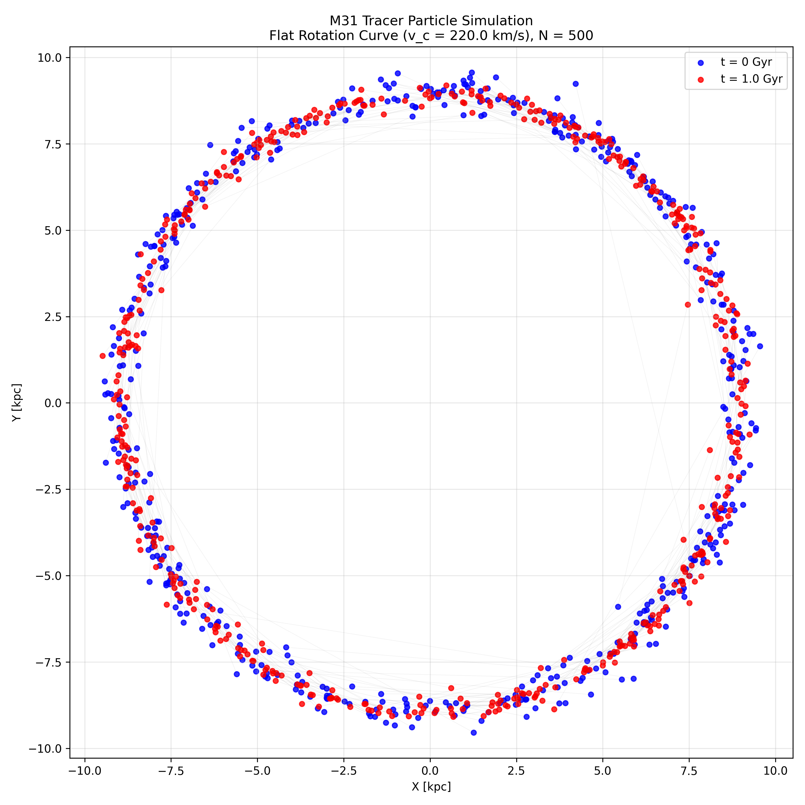

## Example Output
## DOI

This project is archived on Zenodo:

**DOI:** [https://doi.org/10.5281/zenodo.18015688](https://doi.org/10.5281/zenodo.18015688)

**Figure: M31 Tracer Particle Simulation**  
Flat Rotation Curve (v₍c₎ = 220 km/s), N = 500  
- Blue dots: Initial state (t = 0 Gyr)  
- Red dots: Evolved state (t = 1.0 Gyr)  
- Simulation shows orbital coherence and ring persistence over 1 Gyr in a fixed potential
